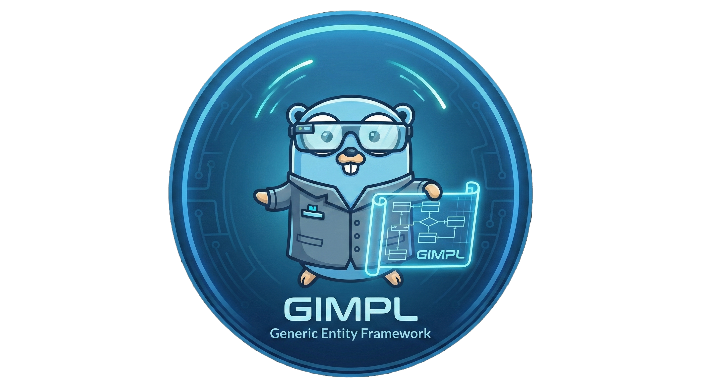

# gimpl


[](https://pkg.go.dev/github.com/pedramktb/go-gimpl)
[](https://goreportcard.com/report/github.com/pedramktb/go-gimpl)
[](https://opensource.org/licenses/BSD-3-Clause)

## Licensing

```
BSD 3-Clause License
Copyright (c) 2025, PedramKTB
See the LICENSE file in the root of this repository for the full license text.
```

## Description
**go-gimpl** (Go Generic Implementation) is a type-safe, enterprise-grade entity framework for Go that provides a clean abstraction layer for database operations. Currently supporting PostgreSQL with extensibility for other databases.

## Features

- 🔒 **Type-Safe**: Leverages Go generics for compile-time type safety
- 🎯 **CRUD Operations**: Full Create, Read, Update, Delete, and Upsert support
- 🔍 **Advanced Filtering**: Expression-based queries with logical operators, conditionals, and quantifiers
- 📄 **Cursor Pagination**: Efficient cursor-based pagination with bidirectional navigation
- 🔄 **Transaction Support**: First-class transaction handling with automatic rollback
- 🏗️ **Clean Architecture**: Separation of concerns with interface-based design
- 🔌 **Extensible**: Easy to implement for different database systems
- ⚡ **Performance**: Built on top of proven libraries (Squirrel, pgx)

## Installation

```bash
go get github.com/pedramktb/go-gimpl
```

## Quick Start

```go
import (
    "github.com/pedramktb/go-gimpl"
    pgimpl "github.com/pedramktb/go-gimpl/pg"
)

// Define your entity
type User struct {
    ID    string
    Name  string
    Email string
}

// Implement the required interfaces (see Architecture section)

// Create datasources
db, _ := sql.Open("postgres", connString)
userFinder := pgimpl.Finder[User](db, "users")
userCreator := pgimpl.Creator[User](db, "users")

// Use the datasources
ctx := context.Background()
user, err := userFinder.FindOne(ctx, filter, nil)
```

## Architecture

go-gimpl follows a **clean architecture** pattern with clear separation between domain models (entities) and data access operations (datasources).

### Core Concepts

#### 1. **Entities**
Entities are domain models that implement specific interfaces depending on the operations they support. All entity methods must use **value receivers** (not pointer receivers).

**Base Entity Interface:**
```go
type Entity interface {
    // Returns pointer to field for filtering operations
    FilterPtr(field string) any
    // Returns pointer to field for sorting operations
    SortPtr(field string) any
}
```

**Operation-Specific Entities:**
- `CreateEntity` - For creation operations
- `UpdateEntity` - For update operations
- `SaveEntity` - For upsert (create or update) operations

**PostgreSQL-Specific Entity Extensions:**
```go
type Entity interface {
    gimpl.Entity
    Column(field string) string           // Maps field to column name
    Columns() []string                     // Returns all columns for SELECT
    NewWithColumnPtrs() (any, []any)      // Creates instance with scan pointers
}

type CreateEntity interface {
    gimpl.CreateEntity
    CreateColumns() []string               // Columns for INSERT
    CreateColumnVals() []any              // Values for INSERT
}

type UpdateEntity interface {
    gimpl.UpdateEntity
    IdentifyColumns() []string            // Columns to identify record (e.g., ID)
    IdentifyColumnVals() []any            // Values to identify record
    UpdateColumns() []string              // Columns to update
    UpdateColumnVals() []any              // Values to update
}
```

#### 2. **Datasources**
Datasources provide type-safe CRUD operations through specialized interfaces:

- **`Finder[E Entity]`** - Query operations
  - `FindOne(ctx, filter, txOpts)` - Find single entity
  - `Find(ctx, filter, paginateOpts, txOpts)` - Find multiple with pagination

- **`Creator[C CreateEntity]`** - Insert operations
  - `Create(ctx, items, txOpts)` - Insert records

- **`Updater[U UpdateEntity]`** - Update operations
  - `Update(ctx, items, txOpts)` - Update records

- **`Saver[S SaveEntity]`** - Upsert operations
  - `Save(ctx, items, txOpts)` - Insert or update records

- **`Remover[E Entity]`** - Delete operations
  - `RemoveOne(ctx, filter, txOpts)` - Delete single record
  - `Remove(ctx, filter, txOpts)` - Delete multiple records

**Creating Datasources (PostgreSQL):**
```go
db, _ := sql.Open("postgres", connString)

finder := pgimpl.Finder[User](db, "users")
creator := pgimpl.Creator[User](db, "users")
updater := pgimpl.Updater[User](db, "users")
saver := pgimpl.Saver[User](db, "users")
remover := pgimpl.Remover[User](db, "users")
```

#### 3. **Expressions (Filtering)**
go-gimpl provides a powerful expression system for filtering with full type safety through JSON unmarshaling.

**Expression Types:**

- **Conditional Expression (`CondExpr`)** - Field comparisons
  ```go
  {"field": "age", "op": "gte", "val": 18}
  {"field": "email", "op": "re", "val": ".*@example.com"}
  {"field": "status", "op": "in", "val": ["active", "pending"]}
  ```

- **Logical Expression (`LogExpr`)** - Combine expressions
  ```go
  {
    "op": "and",
    "left": {"field": "age", "op": "gte", "val": 18},
    "right": {"field": "status", "op": "eq", "val": "active"}
  }
  ```

- **Quantifier Expression (`QuantExpr`)** - Array operations
  ```go
  {"field": "tags", "op": "any", "expr": {"field": "name", "op": "eq", "val": "urgent"}}
  {"field": "scores", "op": "all", "expr": {"field": "value", "op": "gte", "val": 80}}
  ```

**Operators:**
- Conditional: `eq`, `ne`, `gt`, `lt`, `gte`, `lte`, `in`, `nin`, `re` (regex)
- Logical: `and`, `or`
- Quantifiers: `any` (EXISTS), `all` (FOR ALL)

**Usage Example:**
```go
filterJSON := `{"field": "status", "op": "eq", "val": "active"}`
var filter gimpl.Expr
filter.Sample = User{} // Required for type inference
json.Unmarshal([]byte(filterJSON), &filter)

user, err := finder.FindOne(ctx, filter, nil)
```

#### 4. **Pagination**
Cursor-based pagination with bidirectional navigation and custom sorting.

**Components:**
- `Sorts` - Sorting configuration with cursor support
- `Cursor` - Opaque cursor for pagination position
- `Paginated[E]` - Result container with items and metadata
- `PaginationMeta` - Contains total count, next/prev cursors

**Usage Example:**
```go
// Define sorting
sorts := gimpl.Sorts{Sample: User{}}
sorts.FromStr([]string{"created_at:desc", "name:asc"}, "")

// Paginate
paginated, err := finder.Find(ctx, filter,
    []gimpl.PaginateOpt{
        gimpl.WithLimit(20),
        gimpl.WithSorts[User](sorts),
    }, nil)

// Access results
for _, user := range paginated.Items {
    // Process user
}

// Navigate pages
nextCursor := paginated.Meta.Next
prevCursor := paginated.Meta.Prev
```

#### 5. **Transaction Management**
First-class transaction support with automatic rollback and manual control.

**Automatic Transaction (recommended for single operations):**
```go
// Automatically creates, commits, or rolls back
err := creator.Create(ctx, []User{user}, nil)
```

**Manual Transaction (for multiple operations):**
```go
tx, _ := pgimpl.NewTx(ctx, db)
txOpt := pgimpl.WithTx(tx)

// Multiple operations in same transaction
err := creator.Create(ctx, users, txOpt)
if err != nil {
    tx.Finalize(err) // Rolls back
    return err
}

err = updater.Update(ctx, updates, txOpt)
if err != nil {
    tx.Finalize(err) // Rolls back
    return err
}

tx.Finalize(nil) // Commits
```

**Transaction Options:**
- `gimpl.WithTxOpts(...)` - Pass database-specific transaction options
- `pgimpl.WithTx(tx)` - Use existing transaction
- `pgimpl.WithTxAutoFinalize()` - Auto-finalize in nested operations

### Design Principles

1. **Type Safety**: Leverages Go generics for compile-time guarantees
2. **Interface Segregation**: Small, focused interfaces (Finder, Creator, etc.)
3. **Dependency Inversion**: Depend on abstractions (interfaces), not implementations
4. **Immutability**: Value receivers prevent accidental mutations
5. **Extensibility**: Database-agnostic core with adapter pattern for specific databases

## Joining our Discord Community

Join our vibrant Discord community to connect with other go-gimpl users and contributors! Whether you're just getting started or you're a seasoned contributor, our Discord server is the perfect place to:

- 💬 **Ask Questions**: Get help from maintainers and experienced community members
- 🚀 **Share Your Projects**: Show off what you're building with go-gimpl
- 🐛 **Report Issues**: Quick feedback and troubleshooting assistance
- 💡 **Suggest Features**: Share your ideas and influence the roadmap
- 🤝 **Collaborate**: Find contributors for your projects or contribute to others
- 📚 **Learn Best Practices**: Exchange tips, patterns, and architectural insights
- 🎉 **Stay Updated**: Be the first to know about new releases and features

[**Join our Discord Server →**](https://discord.gg/your-invite-link) *(coming soon)*

We're excited to have you as part of our growing community!

---
## License
All material is licensed under the [BSD 3-Clause License](https://opensource.org/licenses/BSD-3-Clause).
